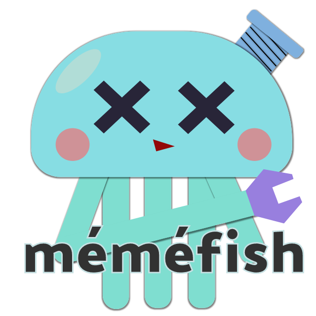

<p align="center">
	
</p>

# méméfish

> méméfish is the foundation to analyze [Spanner][] [SQL][Spanner SQL].

[Spanner]: https://cloud.google.com/spanner/
[Spanner SQL]: https://cloud.google.com/spanner/docs/query-syntax

[![GoDoc Reference][godoc-badge]](https://godoc.org/github.com/MakeNowJust/memefish/pkg)
[![Coverage][codecov-badge]](https://codecov.io/gh/MakeNowJust/memefish/branch/master)

## Features

- Parse Spanner SQL to AST
- Generate Spanner SQL from AST (unparse)
- Check expression type and semantics in SQL statement

Try it!

```console
$ go run ./tools/analyze -param ./tools/param.yml 'select 1 + @foo'
+-------+
|  FOO  |
+-------+
| INT64 |
+-------+

$ go run ./tools/analyze -param ./tools/param.yml 'select @bar + 1 as bar'
analyze error::1:8: operator + requires two INT64/FLOAT64, but: STRUCT<x INT64, y FLOAT64>, INT64

  1:  select @bar + 1 as bar
             ^~~~~~~~

exit status 1
```

## Example

### Parse + Unparse

```go
package main

import (
	"fmt"
	"log"

	"github.com/k0kubun/pp"
	"github.com/MakeNowJust/memefish/pkg/parser"
)

func main() {
	// Create a new Parser instance.
	file := &parser.File{
		Buffer: "SELECT * FROM customers",
	}
	p := &parser.Parser{
		Lexer: &parser.Lexer{File: file},
	}

	// Do parsing!
	stmt, err := p.ParseQuery()
	if err != nil {
		log.Fatal(err)
	}

	// Show AST.
	log.Print("AST")
	_, _ = pp.Println(stmt)

	// Unparse AST to SQL source string.
	log.Print("Unparse")
	fmt.Println(stmt.SQL())
}
```

### Analyze

```go
package main

import (
	"fmt"
	"log"

	"github.com/MakeNowJust/memefish/pkg/analyzer"
	"github.com/MakeNowJust/memefish/pkg/parser"
)

func main() {
	// Create a new Parser instance.
	file := &parser.File{
		Buffer: "SELECT * FROM singers",
	}
	p := &parser.Parser{
		Lexer: &parser.Lexer{File: file},
	}

	// Do parsing!
	stmt, err := p.ParseQuery()
	if err != nil {
		log.Fatal(err)
	}

	// Create table catalog.
	catalog := &analyzer.Catalog{
		Tables: map[string]*analyzer.TableSchema{
			"SINGERS": {
				Name: "Singers",
				Columns: []*analyzer.ColumnSchema{
					{Name: "SingerId", Type: analyzer.Int64Type},
					{Name: "FirstName", Type: analyzer.StringType},
					{Name: "LastName", Type: analyzer.StringType},
				},
			},
		},
	}

	// Create a new Analyzer instance.
	a := &analyzer.Analyzer{
		File:    file,
		Catalog: catalog,
	}

	// Analyze!
	err = a.AnalyzeQueryStatement(stmt)
	if err != nil {
		log.Fatal(err)
	}

	// Get first column information.
	columns := a.NameLists[stmt.Query]
	fmt.Printf("1st column name  : %s\n", columns[0].Text)
	fmt.Printf("1st column type  : %s\n", columns[0].Type)
	fmt.Printf("1st column schema: %#v\n", columns[0].Deref().ColumnSchema) // == catalog.Tables["SINGERS"].Columns[0]
}
```

## TODO

- Make more compatibility
- Add tests for analyzer
- Add DML parsers
- Build Spanner emulator on memefish

## Notice

This project is originally developed under "Expert team Go Engineer (Backend)" of [Mercari Summer Internship for Engineer 2019](https://mercan.mercari.com/articles/13497/).

## License

This project is licensed under MIT license.

2019 (C) TSUYUSATO "MakeNowJust" Kitsune

[godoc-badge]: https://img.shields.io/badge/godoc-reference-black.svg?style=for-the-badge&colorA=%235272B4&logo=go&logoColor=white
[codecov-badge]: https://img.shields.io/codecov/c/github/MakeNowJust/memefish/master.svg?style=for-the-badge&colorA=FF005E&logo=codecov&logoColor=white
